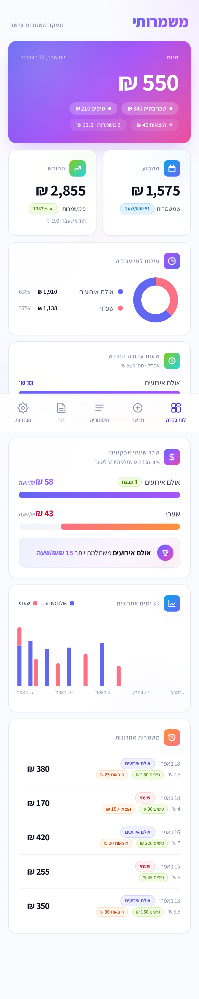
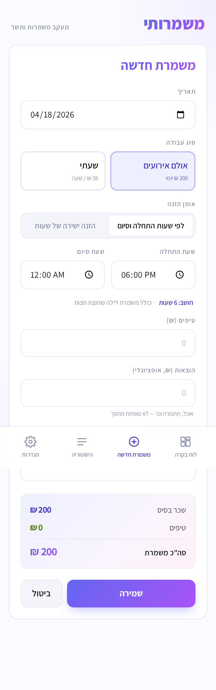
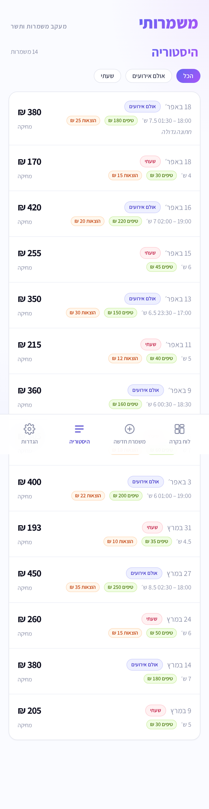

# משמרותי · Mshmaroti

> A Hebrew-first, installable PWA for tracking waitressing shifts across two jobs — with a bento dashboard, effective hourly-rate analytics, and offline-first local storage.

[Hebrew summary](#תקציר-בעברית) · [Live demo](#live-demo) · [Screenshots](#screenshots) · [Development](#development) · [Deploy](#deploy-to-github-pages)

---

## Why

I work two waitressing jobs with different pay structures:

- **Venue work** — flat 200 ₪ per shift regardless of hours, plus tips
- **Hourly gig** — 35 ₪ × hours worked, plus tips

Napkin math told me nothing about which job actually pays better _per hour of my life_. So I built this.

**The key metric: effective ₪/hr across both jobs.** Flat-rate shifts are worth more when they're short; hourly shifts scale with time. This app answers — finally — which job to prioritize.

## Highlights

- **Bento-grid dashboard** — today (hero), week, month vs last month (% delta), job split donut, 30-day stacked trend, recent shifts
- **Two input modes** — enter start + end time (overnight-aware: `20:00 → 02:30` = 6.5h), or direct hours
- **Configurable rates & job names** — no hardcoded values; update in settings, past shifts preserve their computed pay
- **Offline-first** — IndexedDB via Dexie; works without a network
- **CSV export** (UTF-8 BOM so Excel opens Hebrew correctly) + full JSON backup/restore
- **Installable PWA** — add to iOS/Android home screen; standalone fullscreen
- **True RTL** — locked Hebrew locale with proper logical-property layout
- **Zero tracking, zero backend** — everything lives on your device

## Tech

| | |
|---|---|
| Framework | React 18 + TypeScript + Vite |
| Styling | Tailwind CSS (custom obsidian + amber palette) |
| State / storage | Dexie.js over IndexedDB, live queries via `dexie-react-hooks` |
| Charts | Recharts |
| PWA | `vite-plugin-pwa` (Workbox, online-first shell cache) |
| Typography | Bellefair (display) + Rubik (UI) |
| Deploy | GitHub Pages via `gh-pages` branch |

## Architecture

```
src/
├─ types.ts              Shift type (base, tips, optional start/end time)
├─ db.ts                 Dexie schema, CRUD, bulk import
├─ strings.ts            All Hebrew labels (i18n-ready structure)
├─ lib/
│  ├─ calc.ts            Aggregations (today/week/month, job split, 30-day trend)
│  ├─ utils.ts           Date helpers, currency formatting, hoursBetween (overnight)
│  ├─ export.ts          CSV + JSON export with validated import
│  └─ settings.ts        Editable rates/names in localStorage
├─ hooks/
│  ├─ useShifts.ts       Reactive queries (all / recent / filtered)
│  └─ useSettings.ts     Reactive settings
├─ components/
│  ├─ Dashboard.tsx      Bento grid
│  ├─ NewShift.tsx       Dual-mode form with live preview
│  ├─ History.tsx        Filterable list, edit / delete
│  ├─ Settings.tsx       Rate/name editor + data actions
│  └─ tiles/             TodayTile, StatTiles, SplitTile, TrendTile, RecentTile
└─ App.tsx               Tab shell
```

### Design decisions worth calling out

- **Base pay is frozen at shift-creation time** — changing your rate in settings doesn't retroactively rewrite history. This is the correct behavior for a financial log.
- **Overnight shifts** detected with a simple invariant: if `endTime ≤ startTime`, a full day is added. Covers the vast majority of hospitality shifts without needing an explicit "crossed midnight" checkbox.
- **Effective ₪/hr** is computed on the entire shift `total` (base + tips) divided by hours — making flat-rate and hourly shifts directly comparable.
- **CSV uses UTF-8 BOM** — a small detail, but without it Excel mangles Hebrew. Shipping it right.

## Development

```bash
npm install
npm run dev
```

Opens at `http://localhost:5173`. Hebrew-only interface; `lang="he"` and `dir="rtl"` set on `<html>`.

## Deploy to GitHub Pages

1. Push to a GitHub repo (default: `mshmaroti`)
2. Settings → Pages → Build from `gh-pages` branch
3. Deploy:

```bash
npm run deploy
```

If your repo name differs from `mshmaroti`, update the `base` path in `vite.config.ts` or build with `VITE_BASE=/your-repo/ npm run build`.

For a custom domain, build with `VITE_BASE=/`.

## Screenshots

<table>
<tr>
<td width="50%">
<strong>Dashboard</strong><br/>

</td>
<td width="50%">
<strong>New shift — time mode with overnight detection</strong><br/>

</td>
</tr>
<tr>
<td width="50%">
<strong>History with filters</strong><br/>

</td>
<td width="50%">
<strong>Settings — editable rates</strong><br/>

</td>
</tr>
</table>

## Roadmap

- [ ] Month picker in History to scroll further back
- [ ] Goal-tracking tile (user opted out for v1)
- [ ] Optional cloud sync via Supabase
- [ ] Bilingual EN/HE toggle (strings are already centralized)
- [ ] Tax estimate per-shift (Bituach Leumi)

## תקציר בעברית

**משמרותי** — אפליקציית PWA בעברית למעקב אחר משמרות מלצרות בשתי עבודות.

- עבודה 1 (אולם אירועים): שכר יומי קבוע + תשר
- עבודה 2 (שעתי): 35 ₪ לשעה + תשר

לוח בקרה בסגנון bento, ייצוא ל-CSV ו-JSON, תמיכה במשמרות לילה שחוצות חצות, מדד "שכר שעתי אפקטיבי" להשוואה אמיתית בין שתי העבודות. הנתונים נשמרים מקומית במכשיר, אין שרת.

---

Built by [Tamer Adawi (תאמר עדוי)](https://www.linkedin.com/in/tamer-adawi-36a6a91a6/) · 2026
