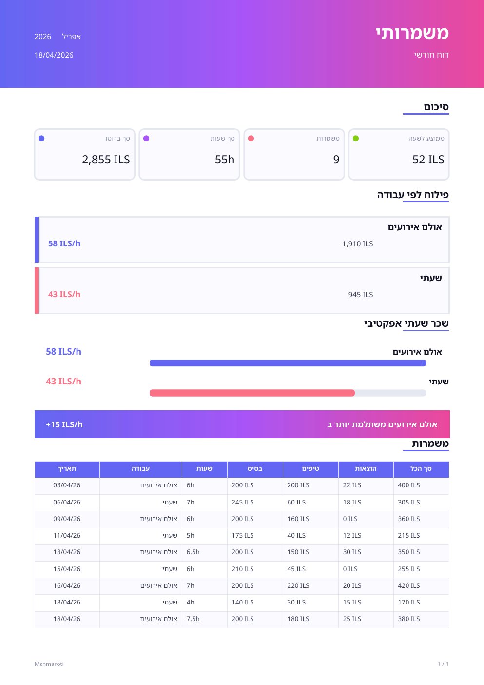

# משמרותי · Mshmaroti

> A Hebrew-first, installable PWA for tracking waitressing shifts across two jobs — bento dashboard, Israeli labor-law payroll (overtime, rest-day, deductions), effective hourly-rate analytics, a monthly calendar heatmap, light/dark themes, and cloud sync.

**🔗 Live demo → [tameradawi.github.io/mshmaroti](https://tameradawi.github.io/mshmaroti/)**


[Live demo](https://tameradawi.github.io/mshmaroti/) · [Hebrew summary](#תקציר-בעברית) · [Highlights](#highlights) · [Development](#development) · [Supabase setup](#supabase-setup) · [Deploy](#deploy-to-github-pages)

---

## Why

I work two waitressing jobs with different pay structures:

- **Venue work** — a flat daily rate per shift regardless of hours, plus tips
- **Hourly gig** — an hourly rate × hours worked, plus tips, subject to Israeli labor law

Napkin math told me nothing about which job actually pays better _per hour of my life_. So I built this.

**The key metric: effective ₪/hr across both jobs.** Flat-rate shifts are worth more when they're short; hourly shifts scale with time (and overtime, and rest-day premiums). This app answers — finally — which job to prioritize, and what I actually take home after deductions.

## Highlights

- **Bento-grid dashboard** — today (hero), week, month vs last month (% delta), effective-rate comparison, job split donut, hours-by-job, gross-vs-net breakdown, 30-day stacked trend, recent shifts
- **Israeli labor-law payroll (hourly job)** — daily overtime tiers (×1.25 then ×1.5), a configurable weekly rest-day window with premium pay, and monthly deductions: Bituach Leumi, pension, income tax, plus a travel allowance. A per-shift rate multiplier can override the automatic calc.
- **Tip law, handled** — venue pay is `base + tips`; hourly pay is `max(hourly wages, tips)` per Israeli tipping rules
- **Two input modes** — start + end time (overnight-aware: `20:00 → 02:30` = 6.5h) or direct hours, with an **unpaid break (minutes)** that deducts from paid hours on the hourly job
- **Monthly calendar heatmap** — browse any month, see earnings intensity per day, tap a day to filter
- **Configurable rates & job names** — no hardcoded values; update in settings, past shifts preserve their computed pay
- **PDF monthly reports** (jsPDF, Hebrew-aware) + **CSV export** (UTF-8 BOM so Excel opens Hebrew correctly) + full JSON backup/restore
- **Cloud sync & multi-user** — Supabase auth (email/password or Google) with row-level security; realtime updates across devices
- **Light & dark themes** — light / dark / system, with a one-tap toggle in the header and a no-flash theme load
- **Installable PWA** — add to iOS/Android home screen; standalone fullscreen; offline shell cache
- **True RTL** — locked Hebrew locale with proper logical-property layout, plus motion that respects `prefers-reduced-motion`

## Tech

| | |
|---|---|
| Framework | React 18 + TypeScript + Vite |
| Styling | Tailwind CSS (custom indigo/violet + pastel palette) |
| Backend | Supabase (Postgres + Auth + Realtime, RLS-protected) |
| Charts | Recharts |
| PDF | jsPDF + jspdf-autotable |
| PWA | `vite-plugin-pwa` (Workbox) |
| Typography | Rubik (display) + Assistant (UI) |
| Theming | Light / dark / system via CSS-variable tokens |
| Deploy | GitHub Actions → GitHub Pages |

## Architecture

```
src/
├─ types.ts              Shift type (base, tips, expenses, optional time + break, multiplier)
├─ strings.ts            All Hebrew labels (i18n-ready structure)
├─ lib/
│  ├─ supabase.ts        Supabase client + DB row types
│  ├─ api.ts             Shift CRUD + bulk import (snake_case ↔ camelCase mapping)
│  ├─ auth.tsx           Auth provider (email/password, Google)
│  ├─ settings.ts        Cloud-backed rates, job names & payroll parameters
│  ├─ payroll.ts         Israeli labor law — OT tiers, rest-day window, monthly deductions
│  ├─ calc.ts            Aggregations (today/week/month, job split, trend, daily totals)
│  ├─ utils.ts           Date/currency helpers, hoursBetween (overnight), calendar matrix
│  ├─ export.ts          CSV + JSON export with validated import
│  ├─ pdfReport.ts       Monthly PDF report
│  ├─ hebrewFont.ts      Embedded Hebrew font for the PDF
│  └─ theme.ts           Light/dark/system preference (persist + apply)
├─ hooks/
│  ├─ useShifts.ts       Reactive shift queries (realtime)
│  ├─ useSettings.ts     Reactive settings (realtime)
│  ├─ useCountUp.ts      Animated number count-up (reduced-motion aware)
│  └─ useTheme.ts        Reactive theme preference
├─ components/
│  ├─ AuthScreen.tsx     Sign in / sign up
│  ├─ Dashboard.tsx      Bento grid
│  ├─ NewShift.tsx       Dual-mode form with live pay breakdown
│  ├─ History.tsx        Month picker + calendar heatmap + filterable list
│  ├─ MonthCalendar.tsx  Per-day earnings heatmap
│  ├─ Report.tsx         Monthly PDF report builder
│  ├─ Settings.tsx       Rates / payroll params / data actions / account
│  └─ tiles/             Today, Week/Month, Split, HoursByJob, EffectiveRate, GrossNet, Trend, Recent
└─ App.tsx               Auth gate + tab shell

supabase/
├─ schema.sql            One-time setup (tables, RLS, signup trigger)
└─ migration_v2.*.sql    Incremental column migrations
```

### Design decisions worth calling out

- **Base pay is frozen at shift-creation time** — changing your rate in settings doesn't retroactively rewrite history. The correct behavior for a financial log.
- **Overnight shifts** are detected with a simple invariant: if `endTime ≤ startTime`, a day is added. Covers the vast majority of hospitality shifts without an explicit checkbox.
- **Unpaid break** is deducted from the start→end span to get paid hours; the rest-day overlap is clamped to paid hours so a break can never produce negative regular hours.
- **Effective ₪/hr** is computed on the entire shift total (pay + tips) divided by hours — making flat-rate and hourly shifts directly comparable.
- **CSV uses UTF-8 BOM** — a small detail, but without it Excel mangles Hebrew.

## Development

```bash
npm install
cp .env.example .env.local   # then fill in your Supabase values
npm run dev
```

Opens at `http://localhost:5173`. Hebrew-only interface; `lang="he"` and `dir="rtl"` set on `<html>`.

### Environment

Create `.env.local` (see `.env.example`):

```
VITE_SUPABASE_URL=https://your-project-id.supabase.co
VITE_SUPABASE_ANON_KEY=your-anon-public-key-here
```

Find both in your Supabase dashboard → **Project Settings → API**.

## Supabase setup

1. Create a Supabase project.
2. In the SQL editor, run `supabase/schema.sql` once (creates the `shifts` and `user_settings` tables, row-level-security policies, and a trigger that seeds default settings on signup).
3. Apply any newer migrations in order — currently up to `supabase/migration_v2.3.sql` (adds the `break_minutes` column).
4. (Optional) Enable the Google provider under **Authentication → Providers** to allow Google sign-in.

## Deploy to GitHub Pages

Deployment is automated by GitHub Actions (`.github/workflows/deploy.yml`): every push to
`main` builds the app and publishes it to GitHub Pages.

1. **Settings → Pages → Source: GitHub Actions**.
2. **Settings → Secrets and variables → Actions** — add the build-time secrets:
   - `VITE_SUPABASE_URL`
   - `VITE_SUPABASE_ANON_KEY`
3. Push to `main`. The workflow builds with `base = /mshmaroti/` and deploys to
   `https://<user>.github.io/mshmaroti/`.

If your repo name differs from `mshmaroti`, set `VITE_BASE=/your-repo/` (or `/` for a custom
domain) in the build step. A manual `npm run deploy` (pushes `dist` to a `gh-pages` branch)
remains available as a fallback.

## Screenshots

<table>
<tr>
<td width="50%">
<strong>Dashboard</strong><br/>

</td>
<td width="50%">
<strong>New shift — time mode with overnight detection</strong><br/>

</td>
</tr>
<tr>
<td width="50%">
<strong>History — calendar heatmap & filters</strong><br/>

</td>
<td width="50%">
<strong>Settings — rates & payroll parameters</strong><br/>

</td>
</tr>
<tr>
<td width="50%">
<strong>Monthly report</strong><br/>

</td>
<td width="50%">
<strong>PDF sample</strong><br/>

</td>
</tr>
</table>

> Screenshots predate the latest visual pass (Rubik font, motion, calendar heatmap, dark mode) and will be refreshed.

## Roadmap

- [x] Dark mode (light / dark / system)
- [ ] Goal-tracking tile (monthly income target with progress ring)
- [ ] Bilingual EN/HE toggle (strings are already centralized)
- [ ] Deeper insights (best weekday, tip-% trends, cumulative earnings)

## תקציר בעברית

**משמרותי** — אפליקציית PWA בעברית למעקב אחר משמרות מלצרות בשתי עבודות, עם סנכרון לענן.

- עבודה 1 (אולם אירועים): שכר יומי קבוע + תשר
- עבודה 2 (שעתי): שכר שעתי + תשר, כולל חישוב שעות נוספות, יום מנוחה וניכויים לפי חוק

לוח בקרה בסגנון bento, לוח חודשי עם מפת חום, ניכוי הפסקה לא בתשלום, מצב בהיר/כהה, דוח PDF חודשי, ייצוא ל-CSV ו-JSON, תמיכה במשמרות לילה שחוצות חצות, ומדד "שכר שעתי אפקטיבי" להשוואה אמיתית בין שתי העבודות. הנתונים נשמרים בענן (Supabase) עם הזדהות והרשאות לכל משתמש.

---

Built by [Tamer Adawi (תאמר עדוי)](https://www.linkedin.com/in/tamer-adawi-36a6a91a6/) · 2026
